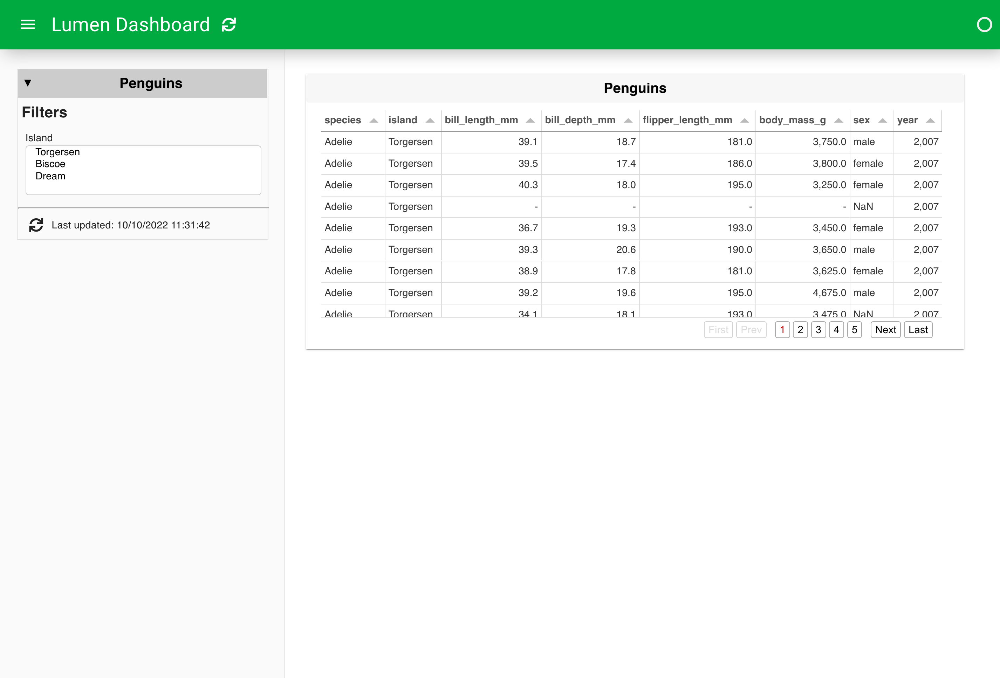
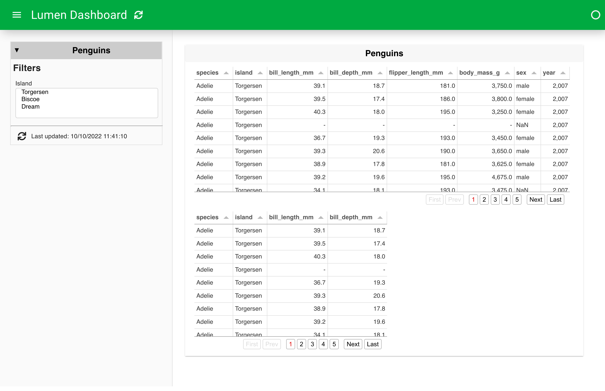

# Branch a pipeline

:::{admonition} What does this guide solve?
:class: important
This guide shows you how to build branching pipelines, allowing for views of the same source data at different steps in processing.
:::

## Overview
See the Background page on [Pipeline Branching](../../background/pipeline_branching).

Continue reading if you are working in YAML (most likely). If you are working in Python, jump to [Branching in Python](#branching-in-python).
## Branching in YAML
As we will see, the essential component of branching in YAML is to use the `pipeline:` parameter.

### Initiating a simple dashboard
Let's first create a simple dashboard without a branch and launch to ensure that things are working properly.
:::{card} penguins.yaml
```{code-block} yaml
sources:
  penguin_source:
    type: file
    tables:
      penguin_table: https://datasets.holoviz.org/penguins/v1/penguins.csv

pipelines:
  penguin_pipeline:
    source: penguin_source
    table: penguin_table
    filters:
      - type: widget
        field: island

layouts:
  - title: Penguins
    sizing_mode: stretch_width
    views:
      - type: table
        pipeline: penguin_pipeline
        show_index: false
        height: 300
```
:::

``` bash
lumen serve penguins.yaml --show --autoreload
```



### Add a branch
Now let's add a new pipeline that branches from the existing pipeline. We can accomplish this by adding a `pipeline:` parameter that refers back to the name of the first pipeline. In our example, our new pipeline, called `branch_sort`, has a `pipeline:` parameter that points back to `penguin_pipeline`.

```{code-block} yaml
:emphasize-lines: 14-18

sources:
  penguin_source:
    type: file
    tables:
      penguin_table: https://datasets.holoviz.org/penguins/v1/penguins.csv

pipelines:
  penguin_pipeline:
    source: penguin_source
    table: penguin_table
    filters:
      - type: widget
        field: island
  branch_sort:
    pipeline: penguin_pipeline
    transforms:
      - type: columns
        columns: ['species', 'island', 'bill_length_mm', 'bill_depth_mm']

layouts:
  - title: Penguins
    sizing_mode: stretch_width
    views:
      - type: table
        pipeline: penguin_pipeline
        show_index: false
        height: 300
```

### Refer to the branch in a new view
Finally, we can create a new view that displays the additional data manipulation steps present on our branch. Below, we simply specify a new table view with a `pipeline:` parameter that refers to our new `branch_sort`.

```{code-block} yaml
:emphasize-lines: 28-31

sources:
  penguin_source:
    type: file
    tables:
      penguin_table: https://datasets.holoviz.org/penguins/v1/penguins.csv

pipelines:
  penguin_pipeline:
    source: penguin_source
    table: penguin_table
    filters:
      - type: widget
        field: island
  branch_sort:
    pipeline: penguin_pipeline
    transforms:
      - type: columns
        columns: ['species', 'island', 'bill_length_mm', 'bill_depth_mm']

layouts:
  - title: Penguins
    sizing_mode: stretch_width
    views:
      - type: table
        pipeline: penguin_pipeline
        show_index: false
        height: 300
      - type: table
        pipeline: branch_sort
        show_index: false
        height: 300
```



## Branching in Python
As we will see below, the primary tool to create a branch of a Lumen pipeline in Python is to use the `pipeline.chain` method.

### Initiating the pipeline
Let's start by creating a pipeline up to a branching point. See the How to guide - [Build a dashboard in Python](ht_pipeline_python) - for a walk-through of these initial steps.

```{code-block} python
from lumen.pipeline import Pipeline
from lumen.sources import FileSource

data_url = 'https://datasets.holoviz.org/penguins/v1/penguins.csv'

pipeline = Pipeline(source=FileSource(tables={'penguins': data_url}), table='penguins')

pipeline.add_filter('widget', field='species')
pipeline.add_filter('widget', field='island')
pipeline.add_filter('widget', field='sex')
pipeline.add_filter('widget', field='year')

pipeline.data
```

### Branching the pipeline
At this point, we will create a branch of our pipeline by using the `pipeline.chain` method, and apply a new transform that aggregates the data, only on this branch. We assign the result to a new `Pipeline` variable so that we can refer to it separately from the original `pipeline`.

```{code-block} python
from lumen.transforms import Aggregate

agg_pipeline = pipeline.chain(transforms=[Aggregate(method='mean', by=['species', 'year'])])

agg_pipeline.data
```

## Related Resources
* Background page on [Pipeline Branching](../../background/pipeline_branching)
